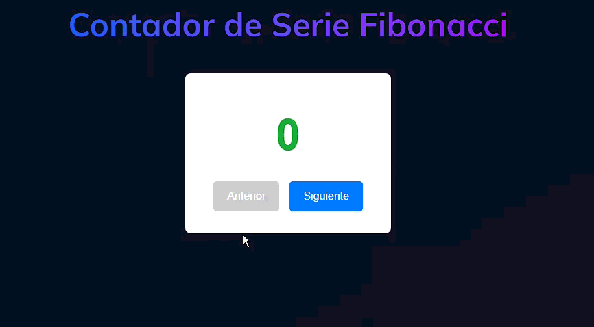

# Ejercicio 2: Fibonacci Counter (Contador de Fibonacci)

## 📝 Descripción

Desarrollar un contador que no se incremente o decremente de uno en uno, sino que avance y retroceda a través de los números de la secuencia de Fibonacci. El contador tendrá dos botones: "Siguiente" y "Anterior".

## 🎯 Objetivos de Aprendizaje

* **Lógica de Estado Compleja:** Gestionar un estado que no es un simple número, sino una posición o índice dentro de una secuencia lógica.
* **Manejo de Eventos:** Utilizar clics en botones para ejecutar una lógica de cálculo y actualizar el estado.
* **Algoritmia Básica:** Implementar la lógica para generar o acceder a los números de la serie de Fibonacci.
* **Renderizado Condicional:** Deshabilitar el botón "Anterior" cuando se está en el primer número de la secuencia (0 o 1).

## ⚙️ Instrucciones

1.  **Estructura Visual (Los Componentes):**
    * Un elemento de texto (ej. `<h2>`) para mostrar el número actual de la secuencia de Fibonacci.
    * Dos botones (`<button>`): uno para "Siguiente" y otro para "Anterior".

2.  **Lógica de Estado (El "Cerebro"):**
    * La forma más sencilla de gestionar el estado es mantener un **índice** de la secuencia, por ejemplo `currentIndex`, que empezará en `0`.
    * No necesitas guardar toda la secuencia en memoria. Puedes calcular el número de Fibonacci correspondiente al `currentIndex` cada vez que se necesite.

3.  **Flujo de Interacción (La "Magia"):**
    * **Botón "Siguiente":** Al hacer clic, incrementa `currentIndex` en 1.
    * **Botón "Anterior":** Al hacer clic, decrementa `currentIndex` en 1. Asegúrate de no permitir que el índice sea menor que `0`.
    * Cada vez que `currentIndex` cambie, el sistema debe calcular el número de Fibonacci para ese nuevo índice (ej. `fib(currentIndex)`) y mostrarlo en pantalla.
    * El cambio de estado también debe evaluar si el botón "Anterior" debe estar deshabilitado (cuando `currentIndex <= 0`).

## 💡 Recomendaciones

* **Función Fibonacci:** Crea una función reutilizable `getFibonacci(n)` que reciba un índice `n` y devuelva el número correspondiente. Puedes implementarla de forma iterativa para mejor rendimiento.
* **Vanilla JS:** Mantén el `currentIndex` en una variable global o en el scope de una función inicializadora. Añade `event listeners` a los botones. En los callbacks, modifica el `currentIndex`, recalcula el número de Fibonacci, y actualiza el `innerText` del display y el atributo `disabled` del botón "Anterior".
* **React/Vue/Angular:** Usa una variable de estado para `currentIndex`. Los clics en los botones llamarán a funciones que actualizan este estado (`setCurrentIndex(currentIndex + 1)`). El número a mostrar será el resultado de llamar a `getFibonacci(currentIndex)`. La propiedad `disabled` del botón se puede vincular condicionalmente: `disabled={currentIndex === 0}`.

## 🎬 Resultado Esperado

