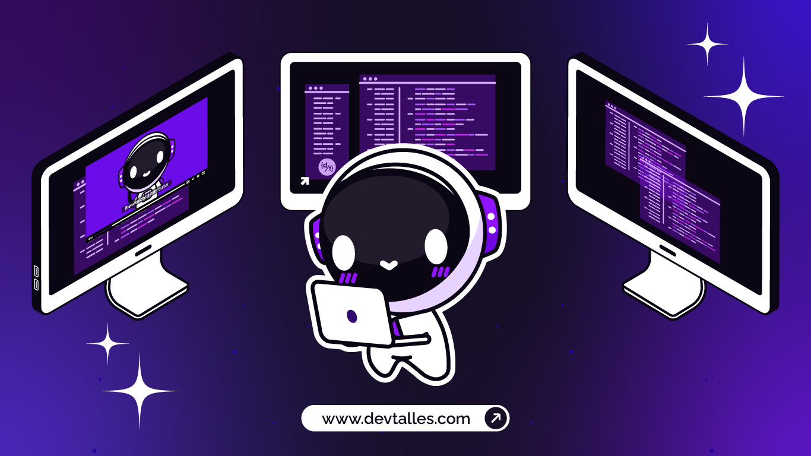

<div align="center">

</div>

<div align="center">

<h1>🚀 DevTalles - Ejercicios Interactivos de Desarrollo Web</h1>


**Una colección completa de ejercicios prácticos de desarrollo web con JavaScript/TypeScript y tecnologías relacionadas organizados por nivel de habilidad**

[](https://developer.mozilla.org/en-US/docs/Web/JavaScript)
[](https://www.typescriptlang.org/)
[](https://developer.mozilla.org/)

</div>

<div align="center">
  
  <h1>🎥 ¿Cómo usar este repositorio?</h1>
  
  <a href="https://www.youtube.com/watch?v=tSueMIDuC50" target="_blank">
    
  </a>

  ### 👆 Haz clic en la imagen para ver las instrucciones en video

</div>

## 📋 Tabla de Contenidos

- ### [🎯 Acerca de este repositorio](#-acerca-de-este-repositorio)
- ### [✅ Requisitos: ¿Estás listo para empezar?](#-requisitos-estás-listo-para-empezar)
- ### [🛠️ ¿Qué herramientas usaremos?](#️-qué-herramientas-usaremos)
- ### [🚀 Empieza tu aventura de programación aquí](#-empieza-tu-aventura-de-programación-aquí)
- ### [🗺️ Mapa del repositorio](#️-mapa-del-repositorio)
- ### [📊 Contenido del repositorio](#-contenido-del-repositorio)
- ### [👨🏻‍💻 Soporte](#-soporte)
- ### [🌐 Redes sociales](#-redes-sociales)

## 🎯 Acerca de este repositorio

¡Bienvenido al **Hub de Ejercicios de Desarrollo Web de DevTalles**! Este repositorio está diseñado para proporcionar una experiencia de aprendizaje estructurada y práctica en desarrollo web moderno, enfocándose en JavaScript/TypeScript y tecnologías relacionadas en un entorno web real.

### 🎓 Objetivos educativos

- **Desarrollo Web Práctico**: Aprende manipulación del DOM, eventos y APIs web
- **Progresión Estructurada**: Camino claro desde conceptos básicos
- **Proyectos Realistas**: Ejercicios que simulan casos de uso del mundo real
- **Tecnologías Modernas**: JavaScript/TypeScript, HTML5, CSS3 y APIs web
- **Metodología DevTalles**: Enfoque práctico y orientado a resultados

## ✅ Requisitos: ¿Estás listo para empezar?

Antes de sumergirte en los ejercicios, asegúrate de tener una base en estas áreas.

| Tecnología / Concepto | Nivel de Conocimiento Requerido | Curso Recomendado |
| :--- | :--- | :--- |
| **Lógica de Programación** | Entender variables, condicionales, ciclos y funciones. | ➡️[`Programación para principiantes`](https://cursos.devtalles.com/courses/programacion-para-principiantes?coupon=learn-01) |
| **HTML y CSS** | Conocimiento básico para estructurar y dar estilos a una página web. | **(Requisito fundamental)** |
| **JavaScript Moderno** | Entender `let`/`const`, *arrow functions* y manipulación del DOM. | ➡️[`JavaScript Moderno: Guía para dominar el lenguaje`](https://cursos.devtalles.com/courses/javascript-moderno?coupon=learn-01) |
| **React.js** | Nociones básicas de componentes y hooks como `useState`, `useEffect` y `useRef`. | ➡️[`React: De cero a experto`](https://cursos.devtalles.com/courses/react-de-cero?coupon=learn-01)|

## 🛠️ ¿Qué herramientas usaremos?

En estos ejercicios, trabajarás principalmente con las siguientes tecnologías modernas del desarrollo web:

| Herramienta | ¿Para qué la usamos? |
| :--- | :--- |
|     | ¡Son los cuatro pilares fundamentales sobre los que construiremos todo! |
|  | La librería de JavaScript para construir las partes visuales e interactivas de nuestras aplicaciones. |
|  | Una herramienta para aplicar estilos de forma rápida y moderna sin salir de nuestro HTML. |
|  | Un motor superrápido que nos ayuda a crear y ejecutar nuestro proyecto de desarrollo. |


## 🚀 Empieza tu aventura de programación aquí

### Este es tu punto de partida. Elige tu nivel y sumérgete en los ejercicios prácticos.

| Nivel | Descripción | ¡Haz clic aquí para empezar! |
| :--- | :--- | :--- |
| **🌱 Principiante** | Aprende a manipular el DOM, manejar eventos y construir componentes básicos. ¡Ideal si estás empezando! | **[➡️ Ir a los Ejercicios de Principiantes](./01-principiante/README.md)** |
| **🔧 Intermedio** | Trabaja con APIs, gestiona datos más complejos y crea aplicaciones funcionales. | **[➡️ Ir a los Ejercicios Intermedios](./02-intermedio/README.md)** |
| **🏆 Avanzado** | Construye features que se conectan con APIs, servicios de autenticación y backends. | **[➡️ Ir a los Ejercicios Avanzados](./03-avanzado/README.md)** |

## 🗺️ Mapa del repositorio

Para que te orientes, así es como están organizadas las carpetas principales en este repositorio:

```
📦 DevTalles - Ejercicios Web Interactivos
├── 📁 01-principiante/      # 🌱 Fundamentos de desarrollo web
├── 📁 02-intermedio/        # 🔧 APIs y funcionalidades avanzadas
├── 📁 03-avanzado/          # 📦 Creación de features y servicios
├── 📁 recursos/         # 📚 Materiales de aprendizaje adicionales y referencias
└──📄 README.md          # 📖 Este archivo que estás leyendo
 
```

## 📊 Contenido del repositorio

### Para que tengas una idea clara del material disponible en cada nivel:

| Nivel | Descripción | Cantidad de Ejercicios |
| :--- | :--- | :--- |
| **🌱 Principiante** | Ejercicios enfocados en los fundamentos del desarrollo web interactivo. |  |
| **🔧 Intermedio** | Ejercicios sobre APIs y funcionalidades avanzadas. |  |
| **🏆 Avanzado** | Desarrollo de features completas que se integran con servicios externos y backends propios. |  |

## 👨🏻‍💻 Soporte y Feedback

### 💬 **¡Únete a nuestra comunidad en Discord!**:  

[](https://discord.gg/pBjEVYTC7t)

[](https://docs.google.com/forms/d/e/1FAIpQLSem8RIXwnA0OQx6jXl7vwd0k6nqcJdyE62NLns3SYYbCxTQew/viewform)

> 💡 **Ayúdanos a mejorar:** Tu opinión es vital para crear nuevos ejercicios y mejorar la experiencia de aprendizaje. ¡Toma solo 2 minutos!


## 🌐 Redes sociales

### **Sitio Web**:  

[](https://cursos.devtalles.com)  

### **Canales de YouTube**:  

[](https://www.youtube.com/@DevTalles) [](https://www.youtube.com/@fernando_her85)  

### **X/Twitter**:   

[](https://twitter.com/DevTalles) [](https://twitter.com/Fernando_her85)

### **Canal de TikTok:**

[](https://www.tiktok.com/@devtallescorp)  

### **Página de Facebook:**

[](https://www.facebook.com/DevTallesCorp)

---