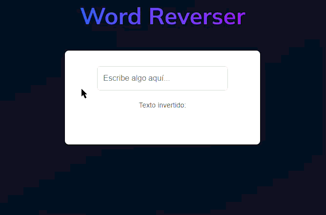

# Ejercicio 4: Word Reverser (Inversor de Palabras)

## 📝 Descripción

Crear una aplicación simple con un campo de texto. A medida que el usuario escribe cualquier palabra o frase en él, el texto invertido debe aparecer en otro lugar de la pantalla en tiempo real.

## 🎯 Objetivos de Aprendizaje

* **Manipulación de Strings:** Practicar métodos comunes para trabajar con cadenas de texto, como dividir, invertir y unir.
* **Manejo de Estado y Eventos:** Vincular el estado de un componente al valor de un `input` y actualizar la UI en cada cambio.
* **Renderizado en Tiempo Real:** Comprender cómo crear una interfaz reactiva que responde instantáneamente a la entrada del usuario.

## ⚙️ Instrucciones

1.  **Estructura Visual (Los Componentes):**
    * Un elemento `<input type="text">` donde el usuario escribirá el texto.
    * Un elemento de texto (como `
` o ``) para mostrar el resultado invertido.

2.  **Lógica de Estado (El "Cerebro"):**
    * Necesitarás una única variable de estado, por ejemplo `textoOriginal`, para almacenar el contenido actual del `input`.

3.  **Flujo de Interacción (La "Magia"):**
    * Asocia un manejador de eventos (`onInput` o `onChange`) al `input`.
    * Cada vez que el evento se dispare, actualiza la variable de estado `textoOriginal` con el nuevo valor del `input`.
    * La parte de la UI que muestra el resultado no necesita su propio estado. Simplemente debe renderizar el valor de `textoOriginal` después de aplicarle la lógica de inversión.

## 💡 Recomendaciones

* **Lógica de Inversión:** La combinación de `split('')` (convierte el string en un array de caracteres), `reverse()` (invierte el array) y `join('')` (une los caracteres de nuevo en un string) es la forma más común y concisa de lograr esto en JavaScript.
* **Vanilla JS:** Selecciona el `input` y el elemento de resultado. Añade un `event listener` `'input'` al `input`. En el callback, obtén el `value` del input, aplica la lógica de inversión y asigna el resultado al `innerText` del elemento de resultado.
* **React/Vue/Angular:** Define una variable de estado `textoOriginal`. Vincula esta variable al `value` del `input` y actualízala con su `onChange`. En el template/JSX, muestra el resultado invertido directamente.

## 🎬 Resultado Esperado

