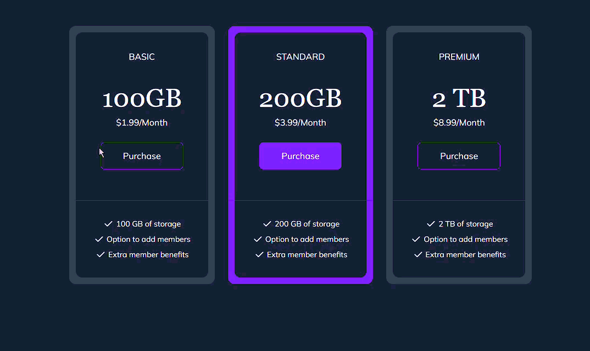

# Ejercicio 7: Tarjetas de Precios

## 📝 Descripción

En este ejercicio, realizarás una tarea fundamental en el desarrollo web moderno: **migrar un diseño existente de una hoja de estilos CSS tradicional a Tailwind CSS**. El objetivo es aprender a pensar en términos de utilidades y a construir interfaces complejas sin escribir una sola línea de CSS personalizado.

Partirás de una maqueta funcional que está estilizada con un archivo `.css` externo. Tu misión será re-implementar el diseño utilizando únicamente las clases de utilidad de Tailwind, logrando un resultado final que sea visualmente idéntico al original.

## 🎯 Objetivos de Aprendizaje

-   **Mentalidad Utility-First**: Refactorizar un componente de CSS tradicional a clases de utilidad de Tailwind.
-   **Mapeo de CSS a Tailwind**: Aprender a "traducir" propiedades de CSS (`background-color`, `border-radius`) a sus clases de Tailwind correspondientes (`bg-*`, `rounded-*`).
-   **Layouts con Flexbox**: Replicar una maquetación existente utilizando las utilidades de Flexbox de Tailwind (`flex`, `flex-col`, `justify-center`).
-   **Diseño Responsivo**: Aplicar variantes responsivas como `md:*` para adaptar el layout en diferentes tamaños de pantalla.
-   **Manejo de Estados y Clases**: Aplicar estilos para interacciones del usuario (`hover:`) y entender cómo se manejarían los estilos condicionales en un componente dinámico.

---

## ⚙️ Instrucciones

1.  **Analiza el Código Base**: Familiarízate con la estructura y los estilos del componente proporcionado. Observa cómo se aplican las clases desde una hoja de estilos CSS para crear el diseño actual.

2.  **Traduce los Estilos**: Comienza a reemplazar las clases de CSS existentes en la estructura del componente por las clases de utilidad de Tailwind. Utiliza la hoja de estilos proporcionada como tu guía o "chuleta" para saber qué estilos necesitas replicar.

3.  **Implementa las Variantes**: Para replicar los diferentes estados de las tarjetas (como la tarjeta destacada), aplica manualmente las clases de Tailwind correspondientes para simular cómo se vería un componente con un estado diferente.

4.  **Aplica los Estilos Responsivos**: Busca las reglas de diseño responsivo en la hoja de estilos y tradúcelas a clases con el prefijo `md:` en tu maquetado para adaptar el diseño a pantallas más grandes.

5.  **Reemplaza los Estados Hover**: Encuentra las pseudo-clases `:hover` en el archivo CSS y aplica sus equivalentes en Tailwind usando el prefijo `hover:`, como `hover:bg-violet-800`.

6.  **Limpieza Final**: Una vez que tu componente se vea idéntico al original usando solo Tailwind, elimina la importación o el enlace a la hoja de estilos tradicional. ¡El refactor estará completo!

---

## 💡 Recomendaciones

-   **CSS vs. Tailwind**: Observa la relación directa entre propiedades y clases. Una regla CSS como `background-color: #1e293b;` se convierte directamente en la clase `bg-slate-800` en tu HTML.
-   **Frameworks (React/Vue/Angular)**: Si bien este ejercicio se realiza con HTML puro, en un framework real no duplicarías el HTML para las variantes. En su lugar, usarías lógica para aplicar clases condicionalmente. Recuerda usar `className` en lugar de `class` en JSX (React).
-   **Extensión de Tailwind en VSCode**: Te recomiendo instalar la extensión "Tailwind CSS IntelliSense". Te dará autocompletado de clases y te mostrará el CSS que genera cada una, lo que acelera enormemente el proceso.

---

## 🎬 Resultado Esperado

El objetivo es que, después de la refactorización, **la interfaz de usuario sea visualmente idéntica a la versión inicial**. El único cambio es la forma en que se aplican los estilos: de una hoja de estilos externa a clases de utilidad de Tailwind directamente en el HTML.

