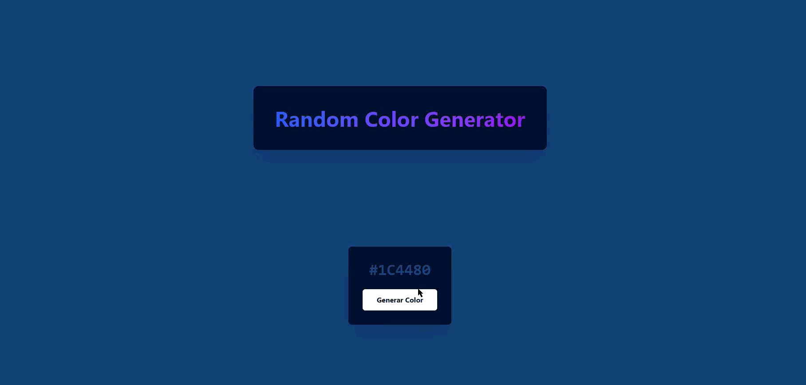

# Ejercicio 13: Generador de Color Aleatorio

## 📝 Descripción

Crear una aplicación simple que genera un color hexadecimal aleatorio y lo aplica como fondo de la página al hacer clic en un botón. El código del color generado también se muestra en pantalla.

## 🎯 Objetivos de Aprendizaje

* **Gestión de Estado de String:** Mantener el valor del color actual en una variable de estado.
* **Manejo de Eventos:** Disparar una función de actualización de estado a través de un clic.
* **Lógica Pura vs. Efectos Secundarios:** Separar la lógica que genera el color (función pura) de la acción que actualiza la UI (efecto secundario).
* **Vinculación de Datos (Data Binding):** Mostrar el valor de una variable de estado directamente en la UI.

## ⚙️ Instrucciones

1.  **Estructura Visual (Los Componentes):**
    * Un elemento de fondo (puede ser el `<body>` o un `div` principal).
    * **`ColorDisplay`:** Un elemento de texto que mostrará el código de color actual.
    * **`GenerateButton`:** Un botón para iniciar la acción.

2.  **Lógica de Estado (El "Cerebro"):**
    * Necesitarás una única variable de estado, `currentColor`, que almacenará el string del código de color hexadecimal (ej. `"#FFFFFF"`).

3.  **Flujo de Interacción (La "Magia"):**
    * Asocia una función `handleGenerate` al evento de clic del `GenerateButton`.
    * **Función `handleGenerate`:**
        1.  Llama a una función de ayuda puramente lógica (`generateHexColor`) que genere y retorne un nuevo código de color.
        2.  Toma el nuevo color y úsalo para **actualizar el estado** de `currentColor`.
    * El sistema de renderizado debe reaccionar al cambio en `currentColor`:
        * El estilo de fondo del elemento principal debe estar vinculado a la variable `currentColor`.
        * El contenido del `ColorDisplay` también debe estar vinculado a `currentColor`.

## 💡 Recomendaciones

* **Función Pura:** La lógica para generar el color (`generateHexColor`) no debe saber nada sobre el DOM o el estado. Su única responsabilidad es devolver un string de color, haciéndola reutilizable y fácil de probar.
* **Vanilla JS:** La "reacción" al cambio de estado es manual. Después de actualizar tu variable `currentColor`, debes escribir el código para cambiar `document.body.style.backgroundColor` y el `textContent` del span.
* **React/Vue/Angular:** Simplemente actualizas el estado (`setCurrentColor(newColor)`) y el framework se encarga de aplicar ese nuevo valor donde sea que lo hayas vinculado en tu plantilla (ej. `style={{backgroundColor: currentColor}}` y `{currentColor}` en React).

## 🎬 Resultado Esperado

