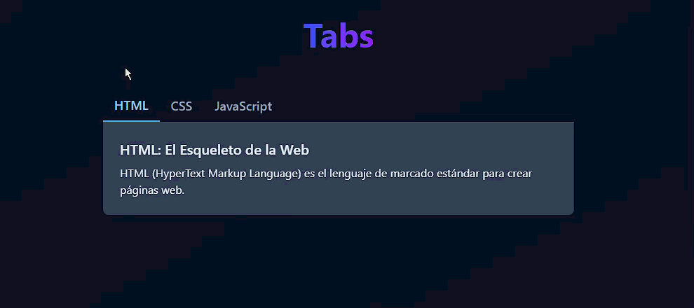

# Ejercicio 20: Tabs (Pestañas)

## 📝 Descripción

Implementar un componente de pestañas que permita al usuario alternar entre diferentes paneles de contenido haciendo clic en las cabeceras de las pestañas. Solo un panel de contenido es visible a la vez.

## 🎯 Objetivos de Aprendizaje

* **Gestión de Estado Activo:** Manejar cuál de varios elementos de control es el "activo".
* **Renderizado Condicional de Contenido:** Mostrar un panel de contenido completo basándose en el estado activo.
* **Componentización:** Crear un componente `Tabs` reutilizable.
* **Accesibilidad (ARIA):** Implementar los roles y atributos ARIA correctos para un componente de pestañas.

## ⚙️ Instrucciones

1.  **Estructura Visual y de Datos:**
    * **Datos:** Un array `tabsData` donde cada objeto tiene `id`, `title`, y `content`.
    * **`TabsContainer`:** El componente principal.
    * **`TabButton`:** Los botones que funcionan como cabeceras de pestaña.
    * **`TabPanel`:** El área donde se muestra el contenido.

2.  **Lógica de Estado (El "Cerebro"):**
    * **`activeTabId`:** Una variable de estado en `TabsContainer` que almacena el `id` de la pestaña actualmente seleccionada.

3.  **Flujo de Interacción (La "Magia"):**
    * El `TabsContainer` renderiza un `TabButton` por cada objeto en `tabsData`.
    * Cada `TabButton` tiene un `onClick` que actualiza el estado `activeTabId` en el `TabsContainer`.
    * El `TabsContainer` busca en `tabsData` el objeto cuyo `id` coincide con `activeTabId` y renderiza su `content` en el `TabPanel`.
    * El `TabButton` activo debe tener un estilo visual diferente.

## 💡 Recomendaciones

* **Accesibilidad:** Este componente tiene requisitos ARIA específicos. Usa `role="tablist"`, `role="tab"`, `role="tabpanel"`, `aria-selected` y `aria-controls` para hacerlo accesible.
* **CSS:** El estado activo del botón se puede manejar con una clase `.active`.
* **Vanilla JS:** Al hacer clic en un botón, se ocultan todos los paneles y se muestra solo el asociado, actualizando clases y atributos ARIA manualmente.
* **React/Vue/Angular:** El estado `activeTabId` vive en el componente padre. El `TabPanel` muestra contenido condicionalmente. Los `TabButton` notifican al padre de los clics.

## 🎬 Resultado Esperado

